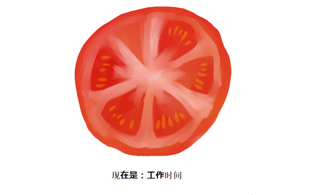

# Tomato Life

Just work hard at every 0-24 and 30-54 minutes.
在每 0-24 分钟和 30-54 分钟努力地工作。

[简体中文](./README.zh-Hans.md)

## Install

You can install me in here.

1. As Chrome Extension (Recommended, keep running in background automatically)
[Go to chrome store](https://chrome.google.com/webstore/detail/tomato-life/kkacpbmkhbljebmpcopjlgfgbgeokbhn)

2. As AHK script run on your windows, will switch your virtual desktop automatically.
[Download the latest release on github](https://github.com/snomiao/tomato-life/releases)

3. Run by `npx -y tomato-life`

## How do this work

Violent Pomodoro Technique

At 25, 55 minutes per hour, a ringing reminder bell sounds, and after 5 minutes, a ringing reminder tone works.

During the rest period, you can get up and move your muscles, stretch out, pour a cup of coffee, tidy up the table, do some simple exercise, reorganize your will, and continue your work in the next 25 minutes.

In every hours, you can hear:

- 00:00 plays C-G notes, means you start to working or learning or whatever
- 25:00 plays G-C notes, reminder you to relax for 5 min
- 30:00 plays C-G notes, means you start to working or learning or whatever
- 55:00 plays G-C notes, reminder you to relax for 5 min

## Want support or pull request?

source on github:
https://github.com/snomiao/tomato-life

Issue and pull requests are welcome.

