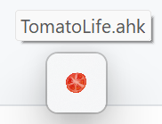

# Tomato Life

Just work hard at every 0-24 and 30-54 minutes.
在每 0-24 分钟和 30-54 分钟努力地工作。

## Install

You can install me in here.

1. As Chrome Extension (Recommended, keep running in background automatically)
[Go to chrome store](https://chrome.google.com/webstore/detail/tomato-life/kkacpbmkhbljebmpcopjlgfgbgeokbhn)

2. As AHK script run on your windows, will switch your virtual desktop automatically.

## How do this work

Violent Pomodoro Technique

At 25, 55 minutes per hour, a ringing reminder bell sounds, and after 5 minutes, a ringing reminder tone works.

During the rest period, you can get up and move your muscles, stretch out, pour a cup of coffee, tidy up the table, do some simple exercise, reorganize your will, and continue your work in the next 25 minutes.

In every hours, you can hear:

- 00:00 plays C-G notes, means you start to working or learning or whatever
- 25:00 plays G-C notes, reminder you to relax for 5 min
- 30:00 plays C-G notes, means you start to working or learning or whatever
- 55:00 plays G-C notes, reminder you to relax for 5 min

## Want support or pull request?

source on github:
https://github.com/snomiao/Tomato-Life

Issue and pull requests are welcome.

## TODO

- [ ] 300x300 icon
- [ ] 440x280 icon
- [ ] 1280x800 screenshot
- [ ] youtube video
- [ ] keywords
- [ ] docsify 
## 安装

你可以在这里安装：

- 作为 Chrome 扩展程序（推荐，装上后可以自动在后台运行）
  https://chrome.google.com/webstore/detail/tomato-life/kkacpbmkhbljebmpcopjlgfgbgeokbhn

## 如何使用

番茄工作法
在每小时的 25, 55 分钟响起休息的提醒铃声，5 分钟再响起工作的提醒铃声。
在休息的时间里，你可以起身活动活动筋骨、伸个懒腰、倒杯咖啡、整理一下桌面、做些简单的运动、重整意志，在下一个 25 分钟继续你的工作吧。

在每个小时中，您都可以听到：

- 00:00 播放 C-G 音符（升调），表示您开始工作或学习
- 25:00 播放 G-C 音符（降调），提醒您放松 5 分钟
- 30:00 播放 C-G 音符（升调），表示您开始工作或学习
- 55:00 播放 G-C 音符（降调），提醒您放松 5 分钟

## 想给它增加功能？欢迎 PR

Github 上的源码地址： https://github.com/snomiao/Tomato-Life
